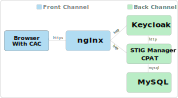

# C-PAT & STIG Manager Non CAC Authentication

## Limitations of this example

This is an example orchestration for deploying C-PAT & STIG Manager with support for user authentication. **The example supports connections to and from `localhost` only and is NOT intended for production use.**

## General architecture



- `nginx` executes a TLS stack with client certificate verification and listens on a front channel HTTPS port.
- `nginx` proxies traffic to `CPAT`, `stigman` and `keycloak` which are listening on back channel HTTP ports.
- `CPAT` and `stigman` communicate with `keycloak` and `mysql` using their back channel ports.
- `browser with CAC` connects to `nginx` on the front channel HTTPS port and requests resources from `CPAT`, `stigman` and `keycloak`.

This general architecture can be implemented with a wide range of technologies, from bare-metal deployments to complex containerized orchestrations. The example uses a simple docker-compose orchestration. 

## Requirements for running the example

- Recent Windows, Linux, or macOS
- docker
- docker-compose
- Chrome, Edge, or Firefox browser

The example uses a server certificate issued to the host `localhost` and signed by a CA named `demoCA`. For the example to work, you must (temporarily) import trust in your browser for the `demoCA` certificate, found at [`certs/ca/demoCA.crt`](certs/ca/demoCA.crt).

> How you do this varies across operating systems and browsers. For Windows, you import the certificate into "Trusted Root Certification Authorities". You should remove the certificate when finished running the orchestrations.

## Fetching the example files

You have two options:

- If you have `git` installed, clone this repository. Then change to the newly created directory.

- Download a ZIP of this repository using the green Code button above. Extract the archive to an appropriate directory and change to the newly extracted directory.
## Starting the orchestration

```
docker-compose up
```

The orchestration's container images will be downloaded if they are not already available on your system. How long this takes depends on your connection speed and registry performance. Once all container images are available, the orchestration will start.

The orchestration has successfully bootstrapped when you see a `started` message like this from the CPAT and STIG Manager API:

```
{"date":"2024-09-27T13:05:19.583Z","level":3,"component":"index","type":"listening","data":{"port":"8086","api":"/api","client":"/","documentation":"/docs","swagger":"/api-docs"}}
```

## Authenticating to CPAT and STIG Manager

Once CPAT and STIG Manager have started, navigate your browser to:

```
https://localhost/cpat/

or

https://localhost/stigman/
```

- You are prompted by your browser to select a certificate from your CAC. You may be asked to enter the PIN for your CAC if you have not done so previously.
- The CPAT or STIG Manager Web App begins to load and redirects your browser to Keycloak for authentication.
- You are prompted by Keycloak to start a Single-Sign On session using your certificate's Common Name (CN) field as the username.
- The CPAT or STIG Manager Web App finishes loading and uses the OAuth2 token generated by Keycloak to make requests to the respective API on your behalf.

You can access the Keycloak admin pages by navigating to:

```
https://localhost/kc/admin
```

Login with the credentials `admin/Pa55w0rd`


## Ending the orchestration

Type `Ctrl-C` to end the orchestration, followed by:

```
docker-compose down
```

> After using Chrome to HTTPS connect to `https://localhost`, you may find Chrome will no longer make HTTP connections to `http://localhost:[ANY_PORT]`. Once you're finished with the example, see [this note](#to-clear-chrome-hsts-entry-for-localhost-perhaps) for how to remedy this.

## Configurations

### Nginx

Client certificate authentication is **required** for access to the Keycloak authorization endpoint. Client certificate authentication is **optional** for API endpoints since access to the API is controlled by OAuth2 tokens.

Nginx requires a PEM file containing certificates for the DoD Root CA and Intermediate CAs used to sign CAC certificates. 

> The example provides the file `certs/dod/Certificates_PKCS7_v5.9_DoD.pem.pem` for this purpose, which is mounted to the Nginx container at `/etc/nginx/dod-certs.pem`

You can [review the file `nginx/nginx.conf`](nginx/nginx.conf).

### C-PAT

The environment variable `CPAT_OIDC_PROVIDER` and `CPAT_CLIENT_OIDC_PROVIDER` are set to the Keycloak back channel and front channel realm URLs, respectively.

### STIG Manager

The environment variables `STIGMAN_OIDC_PROVIDER` and `STIGMAN_CLIENT_OIDC_PROVIDER` are set to the Keycloak back channel and front channel realm URLs, respectively.

### Keycloak

[The Keycloak Guides](https://www.keycloak.org/guides) provide documentation on configuring Keycloak for many deployment scenarios including this example orchestration. 
#### Keycloak Authentication Flow

During startup, Keycloak imports a [realm configuration file](kc/import_realm.json) which includes the `X.509 Browser` Authentication Flow to support X.509 certificate mapping. [This Keycloak documentation](https://www.keycloak.org/docs/latest/server_admin/#_x509) describes how to configure authentication flows to include X.509 client certificates.


The example uses a custom provider [modified from this project](https://github.com/lscorcia/keycloak-cns-authenticator/) that extends the built-in X.509 authenticator. The custom provider will create a new user account if a certificate cannot be mapped to an existing account. The provider file is `kc/create-x509-user.jar` which is mounted to the Keycloak container at `/opt/keycloak/providers`.

#### Keycloak keystores

Keycloak behind Nginx requires a keystore that contains certificates for the DoD Root CA and Intermediate CAs used to sign CAC certificates. 

> The example provides the file `certs/dod/Certificates_PKCS7_v5.9_DoD.pem.p12` for this purpose, which is mounted to the Keycloak container at `/tmp/truststore.p12`

## Notes
### To clear Chrome HSTS entry (for localhost, perhaps)

`chrome://net-internals/#hsts` -  Delete domain security policies

`chrome://settings/clearBrowserData` - Cached images and files


